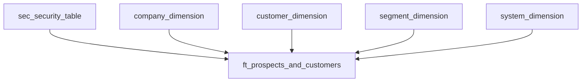

# 🗺️ Customer & Prospect Mapping Report

### 🎯 Overview

This project documents a **Power BI report** built for sales teams, visualizing global customer and prospect locations on an interactive map. When selecting a point (bubble), users can view detailed information about the customer or prospect, including installation base and key attributes.
The report supports **data-driven sales activities**, helping regional managers and sales representatives identify opportunities, manage relationships, and analyze distribution patterns.

---

### 🧱 Data Model Overview

The model combines core data domains to deliver a unified analytical layer:

**Entities:**

* **Security Table:** Controls access for sales roles (RLS applied)
* **Customer Dimension:** Contains customer and prospect master data with hierarchy and region attributes
* **Company Dimension:** Represents legal entities and group relationships
* **Segment Dimension:** Defines market segments and business areas
* **System Dimension:** Includes installed systems and relevant metrics
* **Fact Table:** Links all entities, combining customer and prospect information for reporting

---

### 🧭 Purpose & Audience

The report is designed for **sales and management teams** to:

* Visualize **customer and prospect locations** worldwide
* Identify installed base concentration by region
* Access detailed information on installation sites and system types
* Support account planning and opportunity prioritization

---

### 🧩 Key Features

* 🌍 **Interactive Map View:** Displays customers and prospects geographically
* 🧭 **Customer Detail Pane:** Provides installation and system details for each selected point
* 🧮 **Dynamic Filtering:** Automatically limits visibility through **row-level security (RLS)** based on the logged-in user
* 🧰 **Data Hierarchies:** Business unit → Customer → Installed system
* 🔁 **Refresh Tracking:** Metadata table showing last data refresh timestamp

---

### ⚙️ Row-Level Security (RLS)

RLS ensures that users only see data relevant to their assigned customers or business units.
Two roles are implemented:

* **Managing Director:** Access by business unit
* **Sales Representative:** Access by customer assignment

Security logic is handled in the semantic model, following the centralized `vw_security_table` approach documented in the *Data Security Strategy* case.

---

### 📊 Visual Design

| Page                | Purpose                                                   |
| ------------------- | --------------------------------------------------------- |
| **Cover Page**      | Provides report overview and navigation                   |
| **Map View**        | Displays customer and prospect sites worldwide            |
| **Customer Detail** | Shows system, status, and CRM information                 |
| **FAQ**             | Provides explanations for common questions and usage tips |
| **Change Log**      | Documents updates and data refresh info                   |

---

### 🧠 Technical Highlights

* Built using **Power BI Desktop (Premium)**
* Data sources: Cloud-based data warehouse and CRM exports
* Star schema optimized for analytics (1:* relationships)
* Uses **Azure Entra integration** for user authentication
* Dynamic filtering through DAX-based RLS roles

---

### 🚀 Outcome

* Improved **transparency and sales efficiency** through unified customer view
* Simplified **territory management** using dynamic access control
* Enhanced **strategic planning** through global visualization of customer footprint

---

### 🧭 Learnings

* Combining CRM, DWH, and security logic enables scalable data governance in BI
* Mapping visualizations increase user engagement and actionable insights
* Dynamic RLS integration strengthens data compliance and trust

