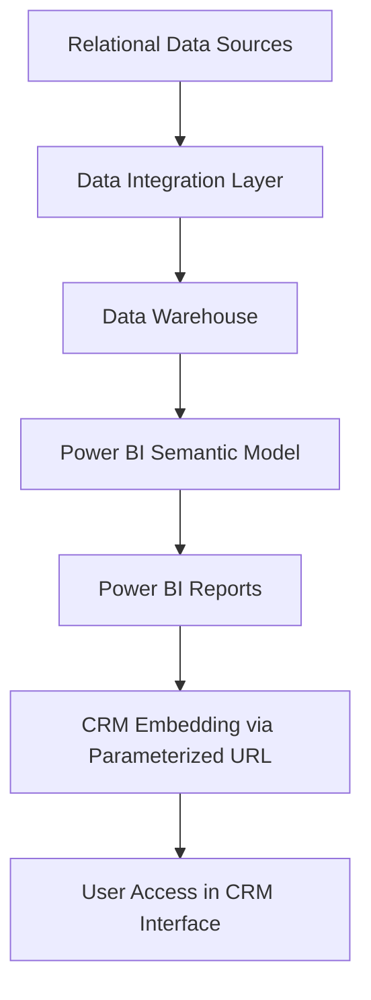

# 📊 Embedded CRM Analytics Dashboards

### 🎯 Overview

This project demonstrates the integration of **Power BI reports within a CRM system** using parameterized URLs.
The solution enables **context-aware filtering** and **centralized access control** without the need for additional role-level security (RLS) configurations inside Power BI.
Reports are dynamically filtered based on a **context parameter** (e.g., product or entity ID) provided by the CRM.

Two Power BI dashboards were implemented:

* **Operational Analytics Report** – focuses on productivity and performance KPIs.
* **Support Performance Report** – provides insights into service requests and response efficiency.

---

### 🧩 Technical Architecture

**Technology Stack:**
Azure Synapse SQL Pool • Power BI Service • CRM Platform • PostgreSQL • MySQL • DAX • Azure Data Factory

---

### ⚙️ Implementation Details

* **Dynamic Embedding:** CRM users access reports via parameterized URLs that pass context identifiers, automatically filtering the displayed content.
* **Access Control:** User permissions are inherited from the CRM system, ensuring data access aligns with CRM-defined roles.
* **Data Refresh:** Reports update daily, ensuring fresh analytical data.
* **KPI Logic:** Key measures are computed using **DAX** expressions and **time intelligence** calculations such as `YTD`, `Month-over-Month`, and `Year-over-Year`.
* **Data Modeling:** The Power BI semantic layer consolidates multiple relational sources through a centralized data warehouse.

---

### 📈 Key Metrics

#### **Operational Dashboard KPIs**

* Availability and utilization ratios (monthly and YTD)
* Volume metrics and efficiency indicators
* Resource consumption trends
* Growth rates and performance comparisons

#### **Support Dashboard KPIs**

* Total service requests and interventions
* Open and critical ticket counts
* Remote resolution percentage
* Average response time
* Breakdown by type, category, and status

---

### 💡 Design and UX

The dashboards are visually aligned with existing CRM interfaces to ensure a seamless transition for end users.
The layout follows a dark-themed UI with intuitive navigation and features:

* KPI summary cards for quick insights
* Drill-through capabilities to view details
* Trend visualizations for operational and service metrics

---

### 🚀 Benefits

* 🔐 **Unified Access Control:** Leverages CRM permissions for simplified data governance.
* ⚡ **Seamless Experience:** Analytics integrated directly into familiar CRM workflows.
* 📊 **Holistic Insight:** Combines operational and service perspectives for each business entity.
* 🧠 **Enhanced Preparation:** Enables teams to make data-informed decisions before client interactions.

---

### 🧭 Learnings

* Parameterized embedding provides a **scalable and secure integration model** for CRM analytics.
* Using CRM-native permissions eliminates duplicate security handling.
* Consistent design standards drive **higher adoption among business users**.

---

**Tags:** `#PowerBI` `#EmbeddedAnalytics` `#DataModeling` `#CRMIntegration` `#DAX` `#DataEngineering`
